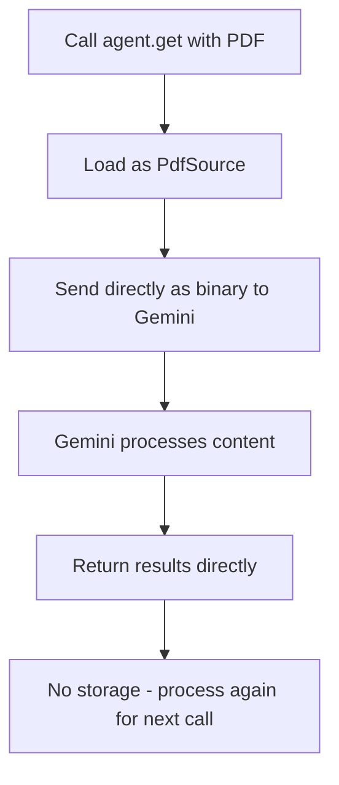
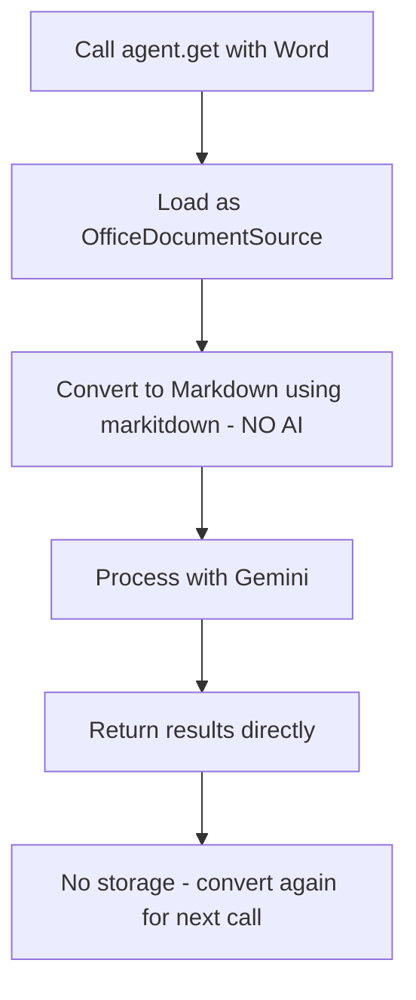

# Extracting Data

## Overview

The `get()` method allows you to extract information from the screen. You can use it to:

- Get text or data from the screen
- Check the state of UI elements
- Make decisions based on screen content
- Analyze static images and documents

## Basic Usage

By default, the `get()` method will take a screenshot of the currently selected display and extract the textual information as a `str`.

```python
# Get text from screen
url = agent.get("What is the current url shown in the url bar?")
print(url)  # e.g., "github.com/login"

# Check UI state
is_logged_in = agent.get("Is the user logged in? Answer with 'yes' or 'no'.") == "yes"
if is_logged_in:
    agent.click("Logout")
else:
    agent.click("Login")

# Get specific information
page_title = agent.get("What is the page title?")
button_count = agent.get("How many buttons are visible on this page?")
```

Instead of taking a screenshot, you can also analyze specific images or documents. Please refer to [11_file_support.md](11_file_support.md) for detailed instructions.

## File Support

### Overview
The AskUI Python SDK supports the use of various file formats.

**Supported File Formats**
- PDF Files (.pdf)
- Excel Files (.xlsx, .xls)
- Word Files (.docx, .doc)
- CSV Files (.csv)

**Model Compatibility Matrix**

| File Format         | AskUI Gemini | Anthropic Claude | Google Gemini
| ------------------- | ------------ | ---------------- | ----------
| PDF (.pdf)          | ✅           | ❌               | ✅
| Excel (.xlsx, .xls) | ✅           | ✅               | ✅
| Word (.docx, .doc)  | ✅           | ✅               | ✅

**General Limitations**
- **Processing Model Restriction**: not all models support all document formats
- **No Caching Mechanism**: All document files are re-processed on every `get()` call
- **Performance Impact**: Multiple documents mean multiple processing operations per run


### 📄 PDF Files (.pdf)

- **MIME Types**: `application/pdf`
- **Maximum File Size**: 20MB
- **Processing Method**: **Depends on Usage Context**


**Processing Workflow for PDF Files:**


**PDF-Specific Limitations**

- **20MB file size limit** for PDF files

### 📊 Excel Files (.xlsx, .xls)

- **MIME Types**:
  - `application/vnd.openxmlformats-officedocument.spreadsheetml.sheet` (.xlsx)
  - `application/vnd.ms-excel` (.xls)


**Features**:
- Sheet names are preserved in the markdown output
- Tables are converted to markdown table format
- Optimized for LLM token usage
- Deterministic conversion process (same input = same output)

**Excel-Specific Limitations**

- **file size limit** depending on the model that is used
- Conversion quality depends on [`markitdown`](https://github.com/microsoft/markitdown) library capabilities
- Complex formatting may be simplified during markdown conversion
- Embedded objects (charts, complex tables) may not preserve all details
- **No AI in conversion**: Conversion is deterministic and rule-based, not AI-powered

### 📝 Word Documents (.doc, .docx)

- **MIME Types**:
  - `application/vnd.openxmlformats-officedocument.wordprocessingml.document` (.docx)
  - `application/msword` (.doc)
**Processing Workflow for Word Documents:**



**Features**:
- Layout and formatting preserved as much as possible
- Tables converted to HTML tables within markdown
- Deterministic conversion process (same input = same output)

**Word-Specific Limitations**

- **file size limit** depending on the model that is used
- Conversion quality depends on [`markitdown`](https://github.com/microsoft/markitdown) library capabilities
- Complex formatting may be simplified during markdown conversion
- Embedded objects (charts, complex tables) may not preserve all details
- **No AI in conversion**: Conversion is deterministic and rule-based, not AI-powered

### 📈 CSV Files (.csv)

- **Status**: **Not directly supported**
- CSV files are treated as regular text content by the LLM

**CSV-Specific Limitations**

- **No specialized CSV parsing**: No structure preservation
- **Text-only processing**: Treated as regular text content by the LLM


### Usage Examples

```python
from askui import ComputerAgent

with ComputerAgent() as agent:
    # PDF
    result = agent.get("Summarize the main points", source="document.pdf")

    # Excel
    result = agent.get("Extract the quarterly sales data", source="sales_report.xlsx")

    # Word
    result = agent.get("Extract all action items", source="meeting_notes.docx")
```


## Structured Data Extraction

### Overview

For structured data extraction, use Pydantic models extending `ResponseSchemaBase`:

```python
from askui import ComputerAgent, ResponseSchemaBase
from PIL import Image
import json

class UserInfo(ResponseSchemaBase):
    username: str
    is_online: bool

class UrlResponse(ResponseSchemaBase):
    url: str

with ComputerAgent() as agent:
    # Get structured data
    user_info = agent.get(
        "What is the username and online status?",
        response_schema=UserInfo
    )
    print(f"User {user_info.username} is {'online' if user_info.is_online else 'offline'}")

    # Get URL as string
    url = agent.get("What is the current url shown in the url bar?")
    print(url)  # e.g., "github.com/login"

    # Get URL as Pydantic model from image at (relative) path
    response = agent.get("What is the current url shown in the url bar?", response_schema=UrlResponse)

    # Dump whole model
    print(response.model_dump_json(indent=2))
    # or
    response_json_dict = response.model_dump(mode="json")
    print(json.dumps(response_json_dict, indent=2))
    # or for regular dict
    response_dict = response.model_dump()
    print(response_dict["url"])
```

### Basic Data Types

```python
# Get boolean response
is_login_page = agent.get(
    "Is this a login page?",
    response_schema=bool,
)
print(is_login_page)

# Get integer response
input_count = agent.get(
    "How many input fields are visible on this page?",
    response_schema=int,
)
print(input_count)

# Get float response
design_rating = agent.get(
    "Rate the page design quality from 0 to 1",
    response_schema=float,
)
print(design_rating)
```

### Complex Data Structures (nested and recursive)

```python
class NestedResponse(ResponseSchemaBase):
    nested: UrlResponse

class LinkedListNode(ResponseSchemaBase):
    value: str
    next: "LinkedListNode | None"

# Get nested response
nested = agent.get(
    "Extract the URL and its metadata from the page",
    response_schema=NestedResponse,
)
print(nested.nested.url)

# Get recursive response
linked_list = agent.get(
    "Extract the breadcrumb navigation as a linked list",
    response_schema=LinkedListNode,
)
current = linked_list
while current:
    print(current.value)
    current = current.next
```

## Limitations

- The support for response schemas varies among models. Currently, the `askui` model provides best support for response schemas as we try different models under the hood with your schema to see which one works best.
- Complex nested schemas may not work with all models.
- Some models may have token limits that affect extraction capabilities.
