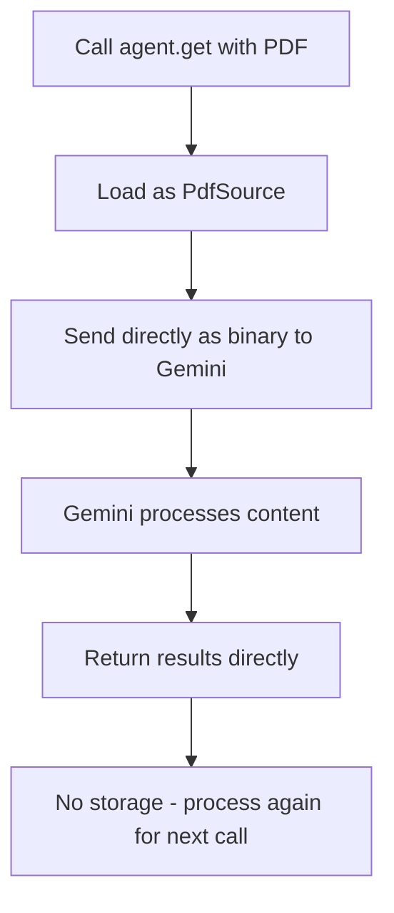
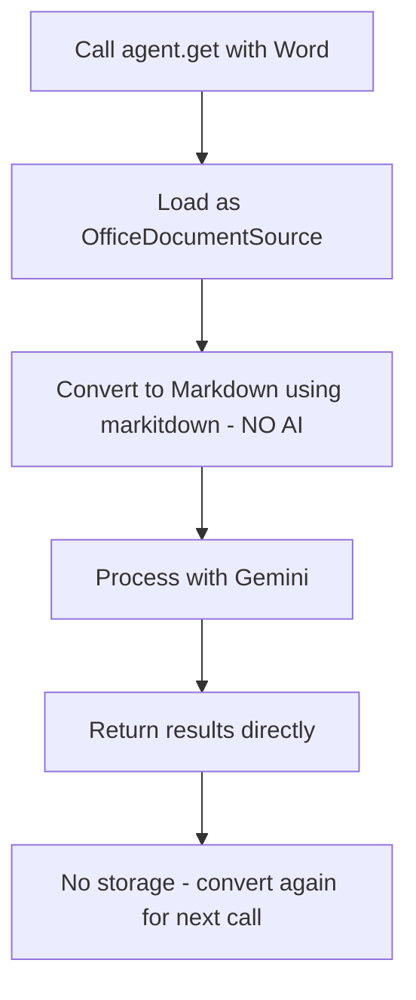

# File Format Support in AskUI Python SDK

The AskUI Python SDK supports the use of various file formats.

#### Supported File Formats
- PDF Files (.pdf)
- Excel Files (.xlsx, .xls)
- Word Files (.docx, .doc)
- CSV Files (.csv)

#### Model Compatibility Matrix

| File Format         | AskUI Gemini | Anthropic Claude | Google Gemini
| ------------------- | ------------ | ---------------- | ----------
| PDF (.pdf)          | ✅           | ❌               | ✅
| Excel (.xlsx, .xls) | ✅           | ✅               | ✅
| Word (.docx, .doc)  | ✅           | ✅               | ✅

####  General Limitations
- **Processing Model Restriction**: not all models support all document formats
- **No Caching Mechanism**: All document files are re-processed on every `get()` call
- **Performance Impact**: Multiple documents mean multiple processing operations per run


## 📄 Processing PDF Files (.pdf)

- **MIME Types**: `application/pdf`
- **Maximum File Size**: 20MB
- **Processing Method**: **Depends on Usage Context**


**Processing Workflow for PDF Files:**


#### PDF-Specific Limitations

- **20MB file size limit** for PDF files

## 📊 Excel Files (.xlsx, .xls)

- **MIME Types**:
  - `application/vnd.openxmlformats-officedocument.spreadsheetml.sheet` (.xlsx)
  - `application/vnd.ms-excel` (.xls)


#### Features:
- Sheet names are preserved in the markdown output
- Tables are converted to markdown table format
- Optimized for LLM token usage
- Deterministic conversion process (same input = same output)

#### Excel-Specific Limitations

- **file size limit** depending on the model that is used
- Conversion quality depends on [`markitdown`](https://github.com/microsoft/markitdown) library capabilities
- Complex formatting may be simplified during markdown conversion
- Embedded objects (charts, complex tables) may not preserve all details
- **No AI in conversion**: Conversion is deterministic and rule-based, not AI-powered

## 📝 Word Documents (.doc, .docx)

- **MIME Types**:
  - `application/vnd.openxmlformats-officedocument.wordprocessingml.document` (.docx)
  - `application/msword` (.doc)
**Processing Workflow for Word Documents:**



#### Features:
- Layout and formatting preserved as much as possible
- Tables converted to HTML tables within markdown
- Deterministic conversion process (same input = same output)

#### Word-Specific Limitations

- **file size limit** depending on the model that is used
- Conversion quality depends on [`markitdown`](https://github.com/microsoft/markitdown) library capabilities
- Complex formatting may be simplified during markdown conversion
- Embedded objects (charts, complex tables) may not preserve all details
- **No AI in conversion**: Conversion is deterministic and rule-based, not AI-powered

## 📈 CSV Files (.csv)

- **Status**: **Not directly supported**
- CSV files are treated as regular text content by the LLM

#### CSV-Specific Limitations

- **No specialized CSV parsing**: No structure preservation
- **Text-only processing**: Treated as regular text content by the LLM


## Usage Examples

```python
from askui import ComputerAgent

with ComputerAgent() as agent:
    # PDF
    result = agent.get("Summarize the main points", source="document.pdf")

    # Excel
    result = agent.get("Extract the quarterly sales data", source="sales_report.xlsx")

    # Word
    result = agent.get("Extract all action items", source="meeting_notes.docx")
```
